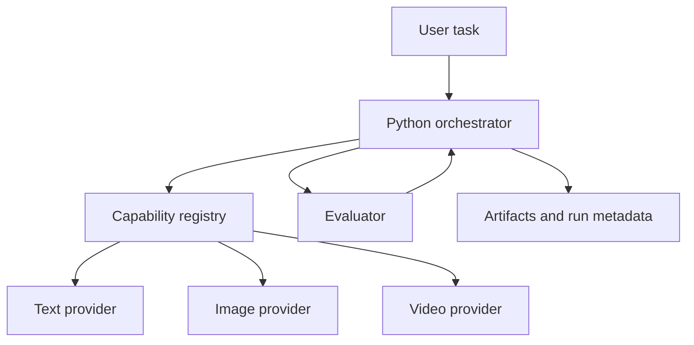

# Multi-Model Workflow Optimization

**English** | [简体中文](README.zh-CN.md)

An experimental research framework for selecting and coordinating models, configurations, and compute resources in adaptive AI workflows.

> **Public research / source-available project.** The research idea, architecture, selected interfaces, and demonstrations are shared publicly. Commercial use requires separate written permission from the author.

## Motivation

AI workflows increasingly combine several capabilities: planning, prompt generation, image and video synthesis, evaluation, retries, and post-processing. This project treats implementations of those capabilities as replaceable computational resources. The long-term goal is to study how an orchestrator can balance output quality, latency, monetary cost, and resource use across an entire workflow.

**Multi-model** refers to choosing among multiple models, providers, or configurations. **Multimodal** refers to handling different media such as text, images, and video. The optimization problem exists even when every candidate serves the same modality.

## Architecture



Provider-specific details stay behind typed capability interfaces. Every call can record its inputs, outputs, configuration, runtime, status, and—when genuinely available—cost and evaluation data.

## Story-to-Video baseline

The first demo is intentionally small:

```text
one story sentence -> four-shot storyboard -> four keyframe records
                   -> three clip records -> evaluation -> run summary
```

The repository currently ships a deterministic mock pipeline. It proves orchestration, state propagation, metadata recording, and retry boundaries without requiring a GPU, external API, or ComfyUI. Mock artifacts are clearly labelled and are not presented as generated media.

```powershell
python -m mmwo.demo "A courier crosses a flooded neon city at dawn." --output outputs/demo
```

## Execution backends

Concrete ComfyUI workflow execution is maintained separately in [comfyui-py-workflow](https://github.com/marsguo2049/comfyui-py-workflow). That project contains the reusable Python client, sanitized API/UI workflow templates, image/video chaining tools, and the bicycle sequence example. This research repository may consume it as an execution backend while keeping routing, evaluation, and optimization experiments independent of ComfyUI-specific graphs.

## Repository layout

- `src/mmwo/capabilities`: typed capability requests, results, and provider protocols
- `src/mmwo/providers`: deterministic mock providers
- `src/mmwo/registry`: provider discovery and capability metadata
- `src/mmwo/workflow`: workflow state, execution, and retry policy
- `src/mmwo/evaluation`: evaluation contracts and simple structural checks
- `src/mmwo/optimization`: future objective and routing baselines
- `demos/story_to_video`: an inspectable end-to-end example
- `docs`: architecture, research problem, roadmap, and demo notes
- `tests`: offline tests that need no model or network access

## Status and roadmap

Status: **prototype / research framework**.

1. Repository foundation and deterministic mock pipeline
2. One reproducible real Story-to-Video workflow
3. Multiple providers/configurations with measured metadata
4. Repeatable evaluation and benchmark tasks
5. Model routing and workflow-level optimization

See [the research roadmap](docs/research-roadmap.md) for details. No optimality or model-superiority claims are made at this stage.

Some future optimization methods, tuned configurations, benchmark data, and research implementations may remain private or be released separately. Public visibility of the repository should not be interpreted as a commitment to publish every research component.

## Reproducibility and privacy

Configuration is externalized and secrets are ignored by Git. Do not commit API keys, personal data, local absolute paths, model weights, private prompts, or large generated assets. Unknown cost, quality, and resource values remain `null` until measured.

## License

Unless a file states otherwise, original repository content is provided under the **PolyForm Noncommercial License 1.0.0**. See [LICENSE](LICENSE).

Noncommercial use covered by that license is permitted. **Commercial use requires separate written permission from the author.** Third-party components, if any, retain their own licenses.

## Research idea and unpublished work

The repository publicly documents a research direction and selected implementations. Copyright licenses govern the repository's protected materials; they do not give exclusive ownership over an abstract research idea. Core algorithms, unpublished experiments, private datasets, and other research components may therefore be kept outside the public repository until an appropriate publication or IP decision has been made.
