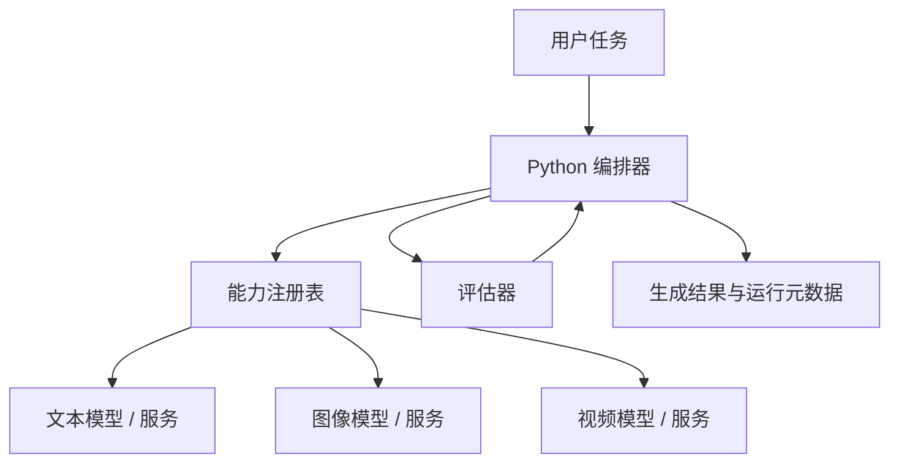

# Multi-Model Workflow Optimization

[English](README.md) | **简体中文**

一个面向自适应 AI 工作流的实验性研究框架，用于研究如何选择和协调不同模型、参数配置与计算资源。

> **公开研究 / source-available 项目。** 本仓库公开研究构想、系统架构、部分接口与演示。商业使用需要事先取得作者的单独书面许可。

## 项目动机

越来越多的 AI 工作流会组合多种能力，例如任务规划、提示词生成、图像与视频生成、结果评估、失败重试和后处理。本项目把实现这些能力的不同模型与配置视为**可替换的计算资源**。长期目标是研究：一个编排器如何在完整工作流中平衡输出质量、时延、货币成本和计算资源消耗。

这里的 **Multi-model（多模型）** 指的是在多个模型、服务提供方或参数配置之间进行选择；**Multimodal（多模态）** 指的是处理文本、图像、视频等不同媒体类型。即使所有候选模型都服务于同一种模态，模型选择与配置优化问题依然存在。

## 系统架构



不同模型或服务的具体实现被封装在带类型约束的 capability interface 后面。每一次调用都可以记录输入、输出、配置、运行时间、状态，以及在确实能够测量时记录成本和评估结果。

## Story-to-Video 基线 Demo

第一版 Demo 会刻意保持小规模、可检查：

```text
一句故事描述 -> 四个分镜 -> 四个关键帧记录
            -> 三个短视频片段记录 -> 评估 -> 运行总结
```

当前仓库提供一个确定性的 mock pipeline。它不需要 GPU、外部 API 或 ComfyUI，就可以验证工作流编排、状态传递、元数据记录和重试边界。所有 mock 结果都会明确标注，不会被包装成真实的 AI 生成媒体。

```powershell
python -m mmwo.demo "A courier crosses a flooded neon city at dawn." --output outputs/demo
```

## 执行后端

具体的 ComfyUI 工作流执行能力已经拆分到独立项目 [comfyui-py-workflow](https://github.com/marsguo2049/comfyui-py-workflow)。该项目包含可复用的 Python 客户端、经过隐私清理的 API/UI 工作流模板、图像与视频串联工具，以及完整的单车序列示例。本研究仓库可以把它作为执行后端使用，同时让模型路由、评估和工作流优化研究不再与某一套 ComfyUI 图绑定。

## 仓库结构

- `src/mmwo/capabilities`：带类型约束的能力请求、结果和 provider 协议
- `src/mmwo/providers`：确定性 mock provider
- `src/mmwo/registry`：provider 发现与能力元数据
- `src/mmwo/workflow`：工作流状态、执行与重试策略
- `src/mmwo/evaluation`：评估接口与基础结构检查
- `src/mmwo/optimization`：未来的目标函数与 routing baseline
- `demos/story_to_video`：可检查的端到端示例
- `docs`：系统架构、研究问题、研究路线与 Demo 文档
- `tests`：无需模型或网络连接即可运行的离线测试

## 当前状态与路线图

当前状态：**prototype / research framework（原型 / 研究框架）**。

1. 仓库基础结构与确定性 mock pipeline
2. 一个可复现的真实 Story-to-Video 工作流
3. 引入多个 provider / 参数配置，并记录实际测量元数据
4. 建立可重复的评估流程与 benchmark 任务
5. 研究模型 routing 与工作流级优化

详细路线见 [research roadmap](docs/research-roadmap.md)。当前阶段不会声称已经得到最优解，也不会在没有实验依据时声称某个模型优于其他模型。

未来部分优化方法、调优后的配置、benchmark 数据和研究实现可能保持私有，或在其他时间单独发布。仓库是公开的，并不意味着所有研究内容都必须公开。

## 可复现性与隐私

配置应尽量外部化，敏感信息通过 Git 忽略规则排除。请不要提交 API Key、个人数据、本机绝对路径、模型权重、私人提示词或大型生成媒体文件。在没有实际测量之前，成本、质量和资源指标应保持为 `null`，而不是使用虚构数值。

## 许可证

除非文件另有说明，本仓库原创内容采用 **PolyForm Noncommercial License 1.0.0**。详见 [LICENSE](LICENSE)。

该许可证覆盖的非商业用途可以使用。**商业使用需要事先取得作者的单独书面许可。** 如仓库涉及第三方组件，则继续遵循其各自原有许可证。

## 研究构想与未公开工作

本仓库公开记录一个研究方向以及部分实现。版权许可证保护的是仓库中的具体代码、文字、图表和其他受版权保护的材料，并不会赋予任何人对抽象研究思想的排他所有权。因此，核心优化算法、未发表实验、私有数据集以及其他研究组件可以继续保留在公开仓库之外，直到完成适合的论文发表、知识产权或公开发布决策。
